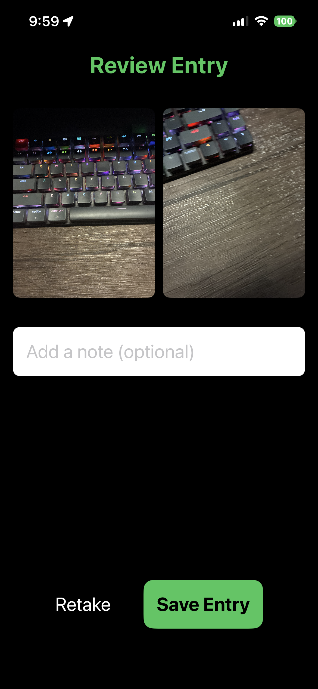

# PhotoLogger

## Overview
PhotoLogger is a SwiftUI app that uses a custom AVFoundation camera component to capture and log "Before" and "After" progress photos. 

## Persistence Strategy
* **Image Files:** Captured photos are saved as JPEG data directly to the app's `Documents` directory using unique UUID-based filenames. 
* **Database:** Large image blobs are not stored in memory. Instead, the `PhotoLogEntry` model stores only the filenames. The log entries are persisted using JSON encoding to a `photologs.json` file in the `Documents` directory. 

## MVVM Folder Structure
* **Models/**: `PhotoLogEntry.swift` - Defines the data structure for a log entry (ID, date, filenames, and notes).
* **Services/**: 
  * `CameraService.swift` - Handles AVFoundation logic, camera permissions, session configuration, and photo capture.
  * `PhotoStore.swift` - Handles saving, loading, and deleting image data to/from the device's local storage.
* **ViewModels/**: `PhotoLogViewModel.swift` - Manages the state of the app, coordinates the capture steps (Before -> After -> Review), and handles saving entries.
* **Views/**: `LogListView.swift`, `CaptureFlowView.swift`, `LogDetailView.swift`, `CameraPreviewView.swift` - Pure SwiftUI UI layers that observe the ViewModel.

## Environment
* **Device / Simulator:** iPhone 16e
* **iOS Version:** iOS 26.3.1

## Screenshots

